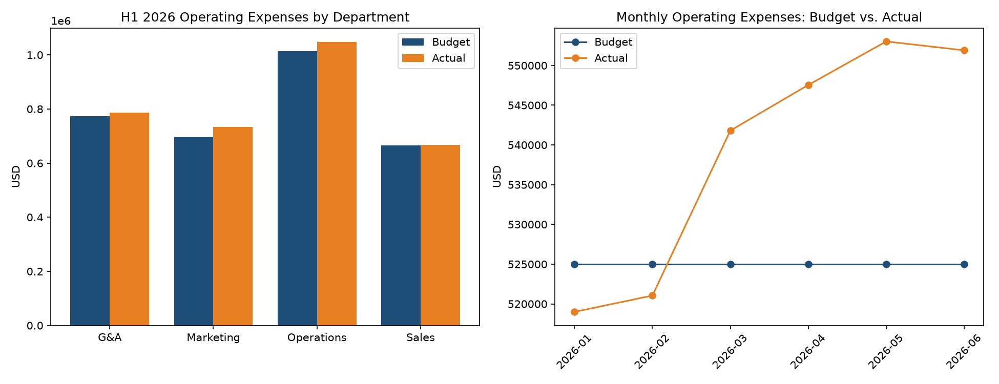

# FP&A Variance Analyzer

Turns raw budget and actuals exports into an executive-ready variance report in seconds.

## Why I built this

I come from an accounting background (multistate sales and use tax, Avalara, NetSuite) and I am moving into FP&A, finance systems, and strategy and operations work. The monthly budget vs. actuals review is one of the most repeated workflows in corporate finance, and in most companies it is still assembled by hand in Excel every single month. This project automates that workflow end to end.

## What it does

- Reads `budget.csv` and `actuals.csv` (the same shape as a standard ERP export, e.g. a NetSuite saved search)

- Calculates dollar and percent variances for every department, account, and month

- Applies real finance logic: revenue above plan is favorable, expense above plan is unfavorable

- Flags material variances (default threshold: 10% and $3,000, both configurable at the top of the script)

- Produces three deliverables automatically:

  1. A formatted, three-tab Excel report (`variance_report.xlsx`)

  2. Budget vs. actual charts by department and by month (`variance_charts.png`)

  3. A plain-English executive summary with the top variance drivers (`executive_summary.txt`)

## Sample output

Excerpt from the auto-generated executive summary:

    Total H1 operating expenses were $3,234,332 against a budget of $3,150,000,

    a variance of $84,332 (+2.7%). Revenue finished $116,848 ahead of plan.

    Top unfavorable drivers:

      - Marketing / Advertising (2026-06): $12,400 over budget (+31.0%)

      - Operations / Contractors (2026-05): $11,250 over budget (+75.0%)

      - Marketing / Advertising (2026-05): $10,000 over budget (+25.0%)

## How to run it

### Option 1: in your browser (no installation)

1. Click the green **Code** button on this repo, open the **Codespaces** tab, and click **Create codespace on main**

2. In the terminal at the bottom, run:

    pip install -r requirements.txt

    python src/variance_analyzer.py

3. The three reports appear in the `output/` folder

### Option 2: on your own computer

Requires Python 3.10 or newer.

    git clone https://github.com/alexsorrell1/fpa-variance-analyzer.git

    cd fpa-variance-analyzer

    pip install -r requirements.txt

    python src/variance_analyzer.py

## Project structure

    fpa-variance-analyzer/

    ├── data/

    │   ├── budget.csv          # sample budget export (fictional data)

    │   └── actuals.csv         # sample actuals export (fictional data)

    ├── src/

    │   └── variance_analyzer.py

    ├── output/                 # generated reports land here

    ├── requirements.txt

    └── README.md

## The data

The sample data is fictional: a company with four departments (Sales, Marketing, Operations, G&A) across H1 2026. To analyze your own numbers, replace the two CSVs with exports that use the same five columns: `month`, `department`, `account`, `account_type`, `amount`.

## Roadmap

- [ ] Move materiality thresholds into a config file

- [ ] Add a rolling forecast tab to the Excel report

- [ ] Sales and use tax reconciliation module (Avalara export vs. GL)

- [ ] Optional AI-generated commentary via an LLM API

## About me

Alex Sorrell. Accounting professional moving into FP&A, finance systems, and strategy and operations roles. Contact: alexlsorrell1@gmail.com

## License

MIT
